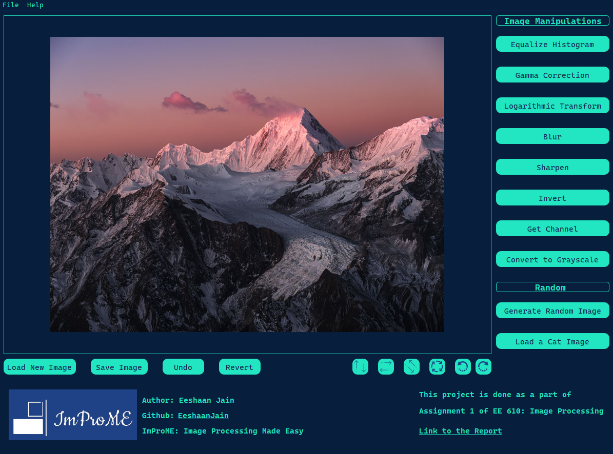

<p align="center">Cancel changes
  
</p>

# ImProME - Image Processing Made Easy

ImProME is a GUI application, made to provide easy access to apply common Image Processing Tasks. This project is done with correspondence to EE 610 - Image Processing (at IIT Bombay)
## Installation
First clone the repository using 

```bash
  git clone https://github.com/EeshaanJain/ImageProcessingGUI
```
Now, to install the required python packages
```bash
pip install -r requirements.txt
```   
## Usage/Examples
To run the GUI, run the app.py file

```bash
python app.py
```
The GUI window looks like this
<p align="center">Cancel changes
  
</p>

1. **Loading an image:** [Shortcut: CTRL+N]

    To load an image, either click on the Load New Image button or go to File>Load Image.

2. **Saving an image:** [Shortcut: CTRL+S]

    To save an image, either click on the Save Image button or go to File>Save Image.

3. **Undo operations:** [Shortcut: CTRL+Z]
    
    To undo the last operation, click the undo button. 

4. **Undo all / Revert:** [Shorctut: CTRL+R]

    To undo all operations (undos till 2nd step, i.e if working with the sample image, an extra manual undo is required), press the Revert button.
5. **Flip Vertically:**

    To flip the image vertically, press the ↑↓ button.

6. **Flip Horizontally:**

    To flip the image horizontally, press the left right arrow button (to the right of the above button).

7. **Flip Diagonally:**
    
    To flip the image diagonally, press the diagonal arrows (second to the right of the flip vertical button).

8. **Rotate arbitrarily:**

    To rotate the image by arbitrary degrees, press the button with 4 arrows (to the right of above).

9. **Rotate anticlockwise:** [Shorctut: CTRL+A]

    To rotate the image anticlockwise, press the anticlockwise arrow (to the right of above).

10. **Rotate clockwise:** [Shortcut: CTRL+C]

    To rotate the image clockwise, press the clockwise arrow (to the right of above).

11. **Histogram Equalization:**

    Click the Equalize Histogram button.

12. **Gamma Correction:**

    Click the Gamma Correction button. Note that the input format is any non-negative decimal/integer.

13. **Log Transform:**

    Click the Logarithmic Transform button.

14. **Blur:**

    Click the Blur button. Note that the following formats are accepted:
    - G <size?> <sigma?> where the ? denote optional parameters. For example:<br>
        - G
        - G 3
        - G 5 2.34
    
    - B <size?>
        - B
        - B 5

    Note that keep the filter size odd.

15. **Sharpen:**

    Click the Sharpen button. Enter any non-negative decimal. It is recommended to keep the value between 0.2 and 0.7.

16. **Invert:**

    Click on the Invert button.

17. **Get Channel:**

    Click on the Get Channel button. Note that the format for input is either R, G or B (one of these three).

18. **Grayscale Conversion:**

    Click on the Convert to Grayscale button to transform the image to the NTSC grayscale format.

19. **Generate Random Image:** [Shortcut: R]

    If you don't have an image, there are some pre-loaded images. One of them is the mountain image shown at the beginning. Other than that, clicking Generate Random Image fetches an image from the Images/random directory

20. **Random Cat Image:** [Shortcut: C]

    A random cat image can be loaded from the Images/cats directory.

21. **Open this repository:**
    
    Clicking either Github: Eeshaan Jain (underlined) or Help opens the repository.

22. **Open report:**

    Clicking Link to the Report opens the report.
    

  
## Contributing

Contributions are always welcome!

  
## Authors

- [@EeshaanJain](https://www.github.com/EeshaanJain)

  
## License

[MIT](https://choosealicense.com/licenses/mit/)
  